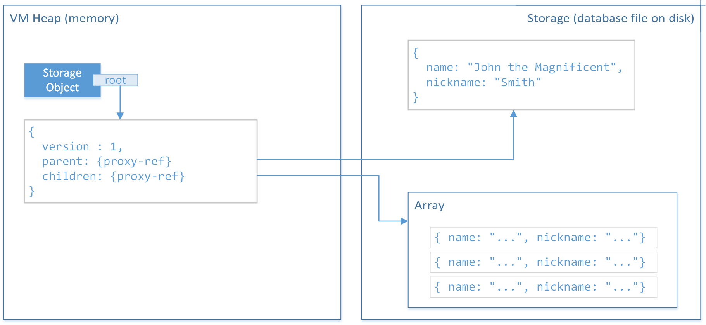

# Architecture of Storage Module

The module uses modified [DyBase Engine of Konstantin Knizhnik](http://www.garret.ru/dybase.html) and
minimal changes in QuickJS core to support persistence in JS.

With enabled CONFIG_STORAGE flag existing ```struct JSObject``` gets additional pointer field:

```C
struct JSObject {
  ...
  JSPersistentBlock* persistent; 
}; 
```

Where JSPersistentBlock defines storage wireing fields. This makes any JS object to be persistable. For now only pure Objects and Arrays are persistable.


Each persistent JS object and array can be in one of four states:

* ```JS_NOT_PERSISTENT``` - not persistent at the moment
* ```JS_PERSISTENT_DORMANT``` - object is persistent but is "dormant", it holds just a reference - item ID in terms of DyBase (dybase_oid_t). Object in this state has no properties or elements loaded into it - it is a {proxy-ref}erence. 
* ```JS_PERSISTENT_LOADED``` - the object has its properties and data loaded from DB;  
* ```JS_PERSISTENT_MODIFIED``` - the object is loaded from DB and is modidied by script - ready to be commited to DB.

## Data life cycle – how persistent mechanism works

Script runtime provides root object when we open existing storage:

```JavaScript
var storage = Storage.open("path/to/data/file.db"); 
var root = storage.root; // root data object
```

Main idea is that the root object will be loaded in half-baked way – all sub-collections in that object will have just persistent proxies instead – things that represent references to corresponding data items in DB:



So immediately after loading root object will look as:

```
storage.root -> { 
     version: 1, 
     parent: /*proxy-ref*/
     children: /*proxy-ref*/
}
```

Those special proxy-references are internal entities – not discoverable by the script.

Instead, when we will need to access those sub-objects, script runtime will fetch them from DB transparently for script code. So when we will need to get some property of sub-object like this:

```JavaScript
console.log(root.parent.name);
```

the runtime will fetch needed object from the DB into VM’s heap (memory) and the root will look like this:

```
storage.root -> {
     version: 1, 
     parent: { name: "John the Magnificent", nickname: "Smith" },
     children: /*array-proxy-ref - not accessed yet*/
}
```

Therefore to get data from the DB we will just need to access elements of collections in DB by standard script means – using obj.prop property accessor or array[index] accessors.

But what will happen with large DB and our code that may walk through all collections inside it? Will whole database be loaded into the heap as a result of visiting all persistent entities?

The answer is “no”. At some point, when runtime will detect that heap is full, garbage collection will be triggered and all persistent entities will be replaced by their proxies. This will free heap from directly unreferenced persistent data. If any of such data contains changes they will be committed (saved) to the database before their removal from the heap.

Therefore data commits (saving data to physical storage) are managed by script runtime automatically: at GC time and when storage gets closed. Script cannot prevent GC to happen nor it cannot force actual GC so data will be auto-commited. But if needed (e.g. after critical data changes), we can call synchronous ```storage.commit()``` method to force changed data to be saved at particular moment of time.

Such mechanism allows script to handle potentially large data sets: maximum number of persistent entities is 2^32 and each persistent item can be a string or a byte array (a.k.a. blob, ArrayBuffer) of size 2^32 bytes.

